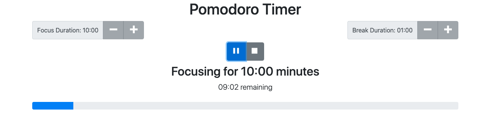

# Pomodoro Timer

## Description

This application is a basic Pomodoro Timer used to enhance productivity and manage time. Typically, users will work in focused intervals of 25 minute sessions, followed by a 5 minute break. This method is designed to be repeated for several intervals.

## Getting Started

1. Select your desired Focus Duration and Break Duration using the **+** and **-** buttons.
2. Press the **Play** button to begin.
3. Press **Pause** button if you want to pause your current session.
4. Press the **Stop** button if you would like to end your session.
5. The Pomodoro Timer will automatically switch between Focus periods and Break periods as time elapses.

## Additional Features

- A bell chime will notify the user when the focus and/or break time has ended
- A progress bar is listed below the countdown timer to track time progressed
- The Focus Duration and Break Duration buttons will be disabled once a session begins. You must end the current session to make adjustments to your intervals.
- Similarly, the Stop button will be disabled until the session begins.

## Technology

- Built using React
- Used conditional rendering to display appropriate components according to sessions (play, pause, stop, etc.)

## Future Goals

- Add a Pomodoro count to keep track of overall progress
- Implement optional background instrumental music and white noises to enhance focus
